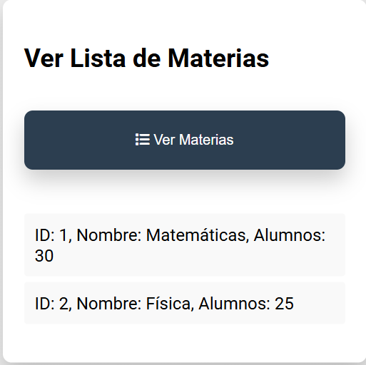
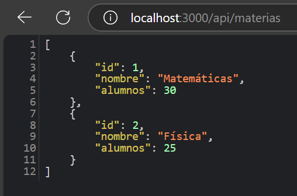

# Gestión de Materias - ISTIC

## Descripción
Esta aplicación permite gestionar las materias de la carrera del ISTIC, permitiendo ingresar nombres de materias y la cantidad de alumnos que tienen. La información se guarda en arreglos y se puede visualizar a través de una interfaz.

## Tecnologías Usadas
- **Node.js**: Lenguaje del servidor.
- **HTML/CSS**: Para la interfaz del sistema.
- **JavaScript**: Para la manipulación del DOM y la lógica del cliente.

## Requerimientos
La aplicación soporta las siguientes operaciones REST en formato JSON:
- **GET /materias**: Obtener un listado de todas las materias.
- **GET /materias/:id**: Obtener información de una materia en particular.
- **DELETE /materias**: Eliminar todas las materias creadas.
- **DELETE /materias/:id**: Eliminar una materia en particular.

## Instalación
1. Clona este repositorio:
    ```bash
    git clone <https://github.com/DVelasco6/TP1.git>
2. Navega al directorio del proyecto:
    ```bash
    cd ~/Desktop/TP1
3. Instala las dependencias necesarias:
    ```bash
    npm install
USO
1. Ejecuta el servidor:
    node server.js
2. Abre tu navegador y visita http://localhost:3000.

## Caso de Prueba: Obtener todas las materias
**Entrada**: Solicitud GET a `/materias`.

**Salida esperada**: Lista de materias en formato JSON.

**Prueba realizada**:
1. Se utilizó la web para enviar una solicitud GET a `http://localhost:3000/materias`.
2. La respuesta fue la siguiente:
    ```json
    [
        { "id": 1, "nombre": "Matemáticas", "alumnos": 30 },
        { "id": 2, "nombre": "Física", "alumnos": 25 }
    ]

## Capturas de Pantalla

1. Captura de la interfaz:
   

2. Ejemplo de respuesta de la API (GET):
   

## Reflexiones
1. Al principio, me costó mucho familiarizarme con Node.js y cómo funciona. Sin embargo, después de ver algunos videos y consultar documentación, logré aprender a manejar rutas y solicitudes HTTP. Esto me ayudó a comprender mejor el flujo de la aplicación y la interacción entre el cliente y el servidor.
2. Aprendi a usar Github!!, algo que cuando lo escuche me sono algo confuso pero logre entenderlo.Supe que git es muy esencial en el 
desarrollo colaborativo.
3. A medida que avanza con el proyecto , también descubrí la importancia de estructurar correctamente el código y mantener una buena organización en los archivos.Mas alla de que me facilita la lectura y el mantenimiento ,tambien permite que otra persona pueda entender
rapido la logica.


